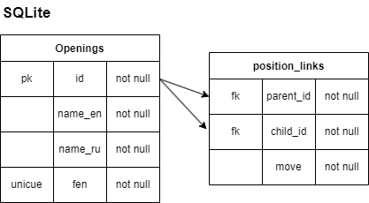
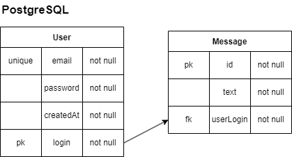

## **♟️ Chess.skibidi**
Учебный проект по программированию для колледжа.

### 📌 **Как запустить проект?**
1. **Скопируйте проект**
```bash
git clone https://github.com/wwweblo/skibidi_chess.git
```

2. **Установить зависимости**  
```bash
npm install
```
3. **env**

Создайте файл .env в корневой папке проекта и заполните его по примеру из `env.exanple`

3. **Запустить сервер** 
> [!IMPORTANT]
> Сервер должен запускться на :3000 порте
  ```bash
  npm run server
  ```
4. **Запустить проект**
  ```bash
  npm run dev
  ```

### 📄 Структура проекта 
Добавь раздел, описывающий папки и файлы проекта:  
```
📂 src
├── 📂 app               # Основные страницы и API
├── 📂 components        # UI-компоненты
├── 📂 data              # Файлы базы данных
├── 📂 lib               # Утилиты, API-запросы
├── 📂 scripts           # Cкрипты
├── 📂 types             # Типы для typescript
├── 📂 utils             # Вспомогательные функции
├── 🛜 server.ts         # Код для подключения с серверной стороны

```

---

## **🛜 API**
Код API находится в `src/app/api` и **автоматически запускается** при `npm run dev`.

### **📌 Аутентификация**
- `POST /api/auth/register` – **Регистрация пользователя**
  ```json
  {
    "login": "skibidi_player",
    "email": "skibidi@example.com",
    "password": "securepassword"
  }
  ```
- `POST /api/auth/login` – **Вход в систему**
  ```json
  {
    "loginOrEmail": "skibidi_player",
    "password": "securepassword"
  }
  ```
- `POST /api/auth/logout` – **Выход из системы**
- `GET /api/auth/me` – **Получение информации о текущем пользователе**

### **📌 Чаты**
- `POST /api/chat/getOrCreateChat` – **Получить чат между 2 пользователями**
  ```json
  {
    "userLogin": "player1",
    "targetLogin": "player2"
  }
  ```
- `GET /api/chat/messages?chatId=<id>` – **Получить сообщения чата**
- `POST /api/chat/send` – **Отправить сообщение**
  ```json
  {
    "chatId": 3,
    "text": "Привет! Как дела?"
  }
  ```

### **📌 Шахматные дебюты**
- `GET /api/openings` – **Получить все шахматные дебюты**
- `GET /api/openings?fen=<FEN>` – **Поиск дебюта по FEN**
- `POST /api/openings` – **Добавить новый дебют**
  ```json
  {
    "name_en": "Ruy-Lopez",
    "name_ru": "Испанская партия",
    "fen": "rnbqkb1r/pppppppp/8/8/8/8/PPPPPPPP/RNBQKB1R w KQkq - 0 1"
  }
  ```
- `PUT /api/openings` – **Обновить дебют**
  ```json
  {
    "id": 3,
    "name_en": "Updated Name",
    "name_ru": "Обновлённое имя",
    "fen": "rnbqkb1r/pppppppp/8/8/8/8/PPPPPPPP/RNBQKB1R w KQkq - 0 1"
  }
  ```
- `DELETE /api/openings` – **Удалить дебют**
  ```json
  {
    "id": 3
  }
  ```

### **📌 Пользователи**
- `GET /api/user?login=<login>` – **Получить информацию о пользователе**

---

## **📄 Данные проекта**
### **♟️ Шахматные дебюты**


- **Исходная база данных** (`src/data/chess_openings_backup`) содержит только таблицу `Openings`.
- Чтобы построить **дерево дебютов**, нужно сгенерировать связи между позициями.  
  Запусти команду:
  ```bash
  npm run generate-links
  ```
  Это выполнит скрипт [generateLinks.ts](src/scripts/generateLinks.ts) и создаст таблицу `position_links`.

### **👨 Пользователи**

