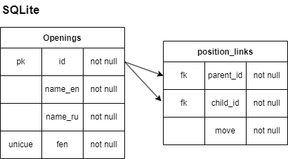

# Chess.skibidi
Course cork for programming collage.

## Database

Original database (`src/data/chess_openings_backup`) is the smallest and the easiest. It contains only `Openings` table.

If you need to build a tree of openings you need to generate links between positions. So run `npm run generate-links` to do so. It will run [generateLinks.ts](src/scripts/generateLinks.ts) and add an extra table `position_links` to the database
